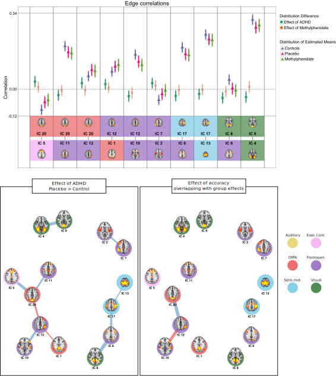

```{r setup, include=F}
knitr::opts_chunk$set(echo=T, warning=FALSE, message=FALSE)
```

class: center, middle

```{r, out.height = "600px", echo=F}

```

---
class: center, middle
```{r, out.height = "600px", echo=F}
knitr::include_graphics("examples/Figure1.svg")
```

---
```{r fig.height=5, fig.width=15}
library(tidyverse)

mtcars %>% gather() %>%  
  ggplot(aes(x=value)) + geom_histogram() + facet_wrap(~key, scales="free", nrow=2)
```

---
## Plotting

#### When wanting to add external images to plots, there are several necessary steps:  
1. You need to create all the images you might want to add, place them in a folder, and give the images names (drop the whitespaces) that make sense according to the data you have.  
1. The images **might** need to be processed to make plotting easier (i.e. them being the same size, backgrounds transparent etc.) I use [ImageMagick](https://www.imagemagick.org/script/index.php) for this, but there are R-packages to help, like [imager](https://cran.r-project.org/web/packages/imager/vignettes/gettingstarted.html)  
1. A clear idea of what you want to plot and why  
- **how** comes with trial-and-error and perserverence (and hopefully with the help of these slides)  

---

### Single brain network images
```{r echo=F}
knitr::include_graphics(list.files("img/single", full.names = T) )
```

---
### Three images per brain network 

```{r echo=F}
knitr::include_graphics(list.files("img/three", full.names = T), dpi = 150)
```

---
### Get images

Get file-paths for all the images
```{r}
{{TRIPLE = list.files("img/three", full.names = T)}}
TRIPLE
```

---
Strip the images of charachters and any non-numeric characters
```{r}
NAMES = gsub("[a-zA-Z]|[[:punct:]]","",TRIPLE)
NAMES
```

Create a data.frame by combining the two vectors, ggplot will be happy for this!
```{r}
DATA = cbind(TRIPLE,NAMES) %>% as.data.frame(stringsAsFactors=F)
DATA %>% glimpse()
```

---

Let's do a very simple plot of the names of the files.
```{r fig.width=20, fig.height=9}
ggplot(DATA) + geom_label(aes(x=NAMES), y=1, label=NAMES) 

```

---
Let's try getting them over several "rows"
```{r fig.width=20, fig.height=9}

DATA$Rows = c(rep(2,20), rep(1,20))
ggplot(DATA) + geom_label(aes(x=NAMES, y=Rows), label=NAMES) 

```


---
Ops! We need to adjust the x-coordinates too!
```{r fig.width=20, fig.height=9}

DATA$Columns = c(1:20, 1:20)
ggplot(DATA) + geom_label(aes(x=Columns, y=Rows), label=NAMES) 

```

---
Let's have a look at how to get an image into the plot.  
Get necessary packages
```{r }
library(png); library(grid)
```

Read in the image
```{r}
img = readPNG(DATA$TRIPLE[1])
```

And transform it into a graphics object (grob)
```{r}
g =  rasterGrob(img, interpolate=TRUE)
```

---
Then we add it to the plot!
```{r fig.width=20, fig.height=9}
ggplot(DATA) + 
  geom_label(aes(x=Columns, y=Rows), label=NAMES) + 
{{  annotation_custom(grob = g, ymin = 1,  ymax =2, xmin = .5, xmax = 1.5) }}


```

---
To add all the images, we need to loop through the list, and add them incrementally, annotations don't take `aes()` in ggplot. 

This requires a couple of steps:
- save the main plot to a global variable
```{r fig.width=20, fig.height=9}

PLOT = ggplot(DATA) + 
  geom_label(aes(x=Columns, y=Rows), label=NAMES) 
```

- create a global variable where the `grob`'s of all the images may be placed.

```{r}
g = list()
```

- create a loop where all the grobs are placed in `g` and are incrementally added to the plot
```{r fig.width=20, fig.height=9}

for(i in 1:nrow(DATA)){
  img = readPNG(DATA$TRIPLE[i])
  g[[i]] = rasterGrob(img, interpolate=TRUE)
  
  PLOT = PLOT +
{{    annotation_custom(
      grob= g[[i]], 
      ymin = DATA$Rows[i]+.1,  ymax = DATA$Rows[i]+.7, 
      xmin = DATA$Columns[i]-.5, xmax = DATA$Columns[i] +.5) 
}}
}

```

---
Let' have a look at that. 
```{r fig.width=20, fig.height=9}

PLOT
```

---
Our top row is "missing". Because `ggplot` sets the plotting area through the first command `geom_label` all the images in the top row is outside the area. We can fix this by chaging the scale!
```{r fig.width=20, fig.height=9}

PLOT + scale_y_continuous(limits=c(1,3))
```

---
Since this isn't really a plot, it's an overview of the images, we may want to strip the plotting area of unecessary information, like axes etc.
```{r fig.width=20, fig.height=9}

PLOT + scale_y_continuous(limits=c(1,3)) + theme_void()
```

---
class: inverse, center, middle

We've successfully added external images to a plot.  

# Well done, us!

But not a "true" plot, let's give a barchart a go!

---
To make a barchart, let's just assing some random values to the various images, and plot them like that.

```{r fig.width=20, fig.height=9}
DATA$Values = sample(1:100, size=nrow(DATA), replace=T)

ggplot(DATA) + geom_histogram(aes(x=NAMES, y=Values), stat="identity")
```

---
First thing's first, the labels are impossible to read like this. Let's rotate them a little.

```{r fig.width=20, fig.height=9}
ggplot(DATA) + geom_histogram(aes(x=NAMES, y=Values), stat="identity") + 
  theme(axis.text.x = element_text(angle=60))
```

---
I'm happy with that for now. Now, I'd like to add the brain images at the bottom, to help readers remember what labels goes with which brain. Let's start with a single one, and adjust the plot accordingly.

Let's read in the file paths for all the images in `img/single`, and create a grob from the first image, just like before.

```{r }
PLOT = ggplot(DATA) + geom_histogram(aes(x=NAMES, y=Values), stat="identity") + 
  theme(axis.text.x = element_text(angle=60))

DATA$SINGLES = list.files("img/single", full.names = T)

img = readPNG(DATA$SINGLES[1])
g = rasterGrob(img, interpolate = T)


PLOT = PLOT + 
  annotation_custom(grob = g, ymin = 1,  ymax = 2, 
                    xmin = .5, xmax = 1.5) 

```

---
Let's have a look at that.

```{r fig.width=20, fig.height=9}
PLOT
```

---
Do you see it? It's that teeny tiny speck at the bottom of the first column. Well, we need to get that sorted for sure, the size is completely off.

```{r fig.width=20, fig.height=9}
ggplot(DATA) + geom_histogram(aes(x=NAMES, y=Values), stat="identity") + 
  theme(axis.text.x = element_text(angle=60)) + 
  annotation_custom(grob = g, ymin = 1,  ymax = 10, xmin = .5, xmax = 1.5) 
```

---
Much better! Let's chuck them all in there, with a loop like last time. Since we also want everything on one row (compared to two before), we add a column with a counter before we start.

```{r fig.width=20, fig.height=9}
DATA$N = seq(1,nrow(DATA))
PLOT = ggplot(DATA) + geom_histogram(aes(x=NAMES, y=Values), stat="identity") + theme(axis.text.x = element_text(angle=60)) 

g = list()
for(i in 1:nrow(DATA)){
  img = readPNG(DATA$SINGLES[i])
  g[[i]] = rasterGrob(img, interpolate = T)
  
  PLOT = PLOT +
    annotation_custom(
      grob= g[[i]], 
      ymin = 1,  ymax = 10, 
      xmin = DATA$N[i]-.4, xmax = DATA$N[i] +.4) 
}
```

---
Let's have a look at that.

```{r fig.width=20, fig.height=9}
PLOT
```

---
Right'o! They're all there. But their placement is a little inconventient. We can put them at the top of their bars, if we want.

```{r fig.width=20, fig.height=9}
PLOT = ggplot(DATA) + geom_histogram(aes(x=NAMES, y=Values), stat="identity") + theme(axis.text.x = element_text(angle=60)) 

g = list()
for(i in 1:nrow(DATA)){
  img = readPNG(DATA$SINGLES[i])
  g[[i]] = rasterGrob(img, interpolate = T)
  
  PLOT = PLOT +
    annotation_custom(
      grob= g[[i]], 
      ymin = DATA$Values[i],  ymax = DATA$Values[i]+10, 
      xmin = DATA$N[i]-.4, xmax = DATA$N[i] +.4) 
}
```

---
Let's have a look at that.

```{r fig.width=20, fig.height=9}
PLOT
```

---
Some of them end up outside the chart limits, but we can solve that again.

```{r fig.width=20, fig.height=9}
PLOT + scale_y_continuous(limits=c(0,105))
```

---
We can also place them below the bars.

```{r fig.width=20, fig.height=9}
PLOT = ggplot(DATA) + geom_histogram(aes(x=NAMES, y=Values), stat="identity") + theme(axis.text.x = element_text(angle=60)) 

g = list()
for(i in 1:nrow(DATA)){
  img = readPNG(DATA$SINGLES[i])
  g[[i]] = rasterGrob(img, interpolate = T)
  
  PLOT = PLOT +
    annotation_custom(
      grob= g[[i]], 
      ymin = -Inf,  ymax = 0, 
      xmin = DATA$N[i]-.4, xmax = DATA$N[i] +.4) 
}
```

---
Let's have a look at that.

```{r fig.width=20, fig.height=9}
PLOT
```

---
The labels are crashing with the images! We can adjust them to appear slightly further down with `vjust`.

```{r fig.width=20, fig.height=9}
PLOT + theme(axis.text.x = element_text(angle=60, vjust=.5)) 
```

---
The images are very small. We might consider only to plot the bars and corresponding images that have larger bars. The will provide more space.

We will need to subset the data a little first, keeping only data value above 25.

```{r}
DATA_sub = DATA %>% filter(Values > 60)
```

Then we do the same as before, just with the new data
```{r fig.width=20, fig.height=9}
PLOT = ggplot(DATA_sub) + geom_histogram(aes(x=NAMES, y=Values), stat="identity") + theme(axis.text.x = element_text(angle=60)) 

g = list()
for(i in 1:nrow(DATA_sub)){
  img = readPNG(DATA_sub$SINGLES[i])
  g[[i]] = rasterGrob(img, interpolate = T)
  
  PLOT = PLOT +
    annotation_custom(
      grob= g[[i]], 
      ymin = -Inf,  ymax = 0, 
      xmin = DATA$N[i]-.4, xmax = DATA$N[i] +.4) 
}
```

---
Let's have a look at that.  

```{r fig.width=20, fig.height=9}
PLOT
```

---
Great! Now we need to adjust the image-sizes, and we only need to fix the scale!

```{r fig.width=20, fig.height=9}
PLOT + scale_y_continuous(limits=c(-10,105)) + theme(axis.text.x = element_text(angle=60, vjust=.5), axis.text = element_text(size = 20))
```


---
class: inverse, center, middle

# There you go!

A small intro to adding images directly to your plots!