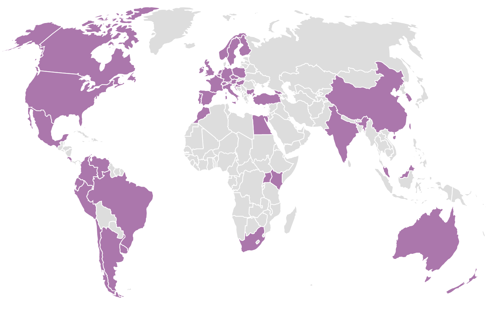
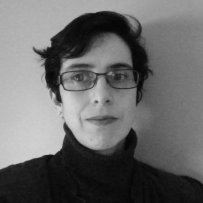

```{r setup, include=FALSE}
options(htmltools.dir.version = FALSE)
```

class: center, middle

<div style="vertical-align: middle;display: inline-block; width:400px;">

</div> 
# is a worldwide organication whose mission is to promote gender diversity in the R community

---
# R-Ladies
<div style="vertical-align: middle;display: inline-block; width:750px;">

</div>
_R-Ladies at useR 2017_

R-Ladies’ primary focus is on supporting minority gender R enthusiasts to achieve their programming potential, by building a collaborative global network of R leaders, mentors, learners, and developers to facilitate individual and collective progress worldwide.

---

# R-Ladies
## History
<div style= "float:right;position: relative;  padding: 10px;">

</div>
### Gabriela de Queiroz founded R-Ladies on October 1, 2012. She wanted to give back to the community after going to several meetups and learning a lot for free.  The first meetup was placed in San Francisco, California (United States). 

---
# R-Ladies

### R-Ladies now has over 13.000 members across 63 chapters, and it growing almost exponentially! 

### The community is large, supportive and very active.

---
# R-Ladies


---
# R-Ladies

- R-Ladies is a user-run group, meaning it is all of us that keep it going.

- Everyone is welcome to present something, no matter their skill level. 

- Presentations may be to showcase something you've been working on, to get feed-back on your approach or code, or just because you want to contribute and practise giving talks about coding.

- Everyone has something new to learn, and even a novice may have found an interesting way of doing someting an expert didn't think of.


---
# R-Ladies Oslo leadership team
#### Get in touch with us!

```{r, out.width = "220px", echo=F}
knitr::include_graphics("img/Athanasia.Mowinckel.2_square.jpg")
knitr::include_graphics("img/Lene.jpg")
knitr::include_graphics("img/Aurora2.jpg.png")

knitr::include_graphics("img/Isa2.jpeg.png")
```


---
class: inverse, center, middle
# Launch survey

#### Please answer a very short survey we made to map who you are and what you want to get out of this user group.

## https://bit.ly/2F4P6Sh

