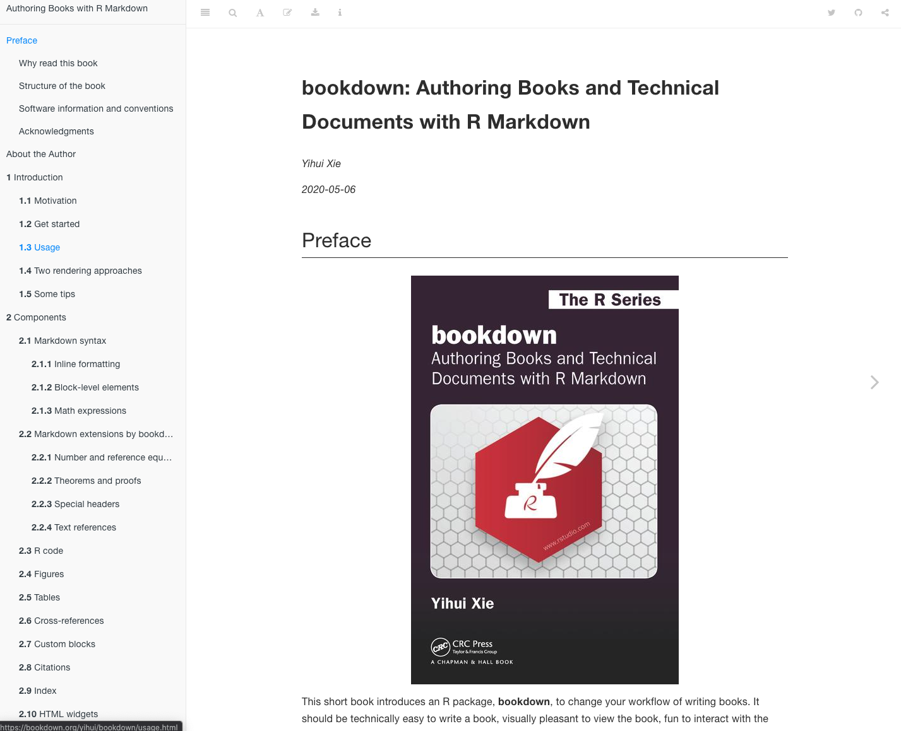
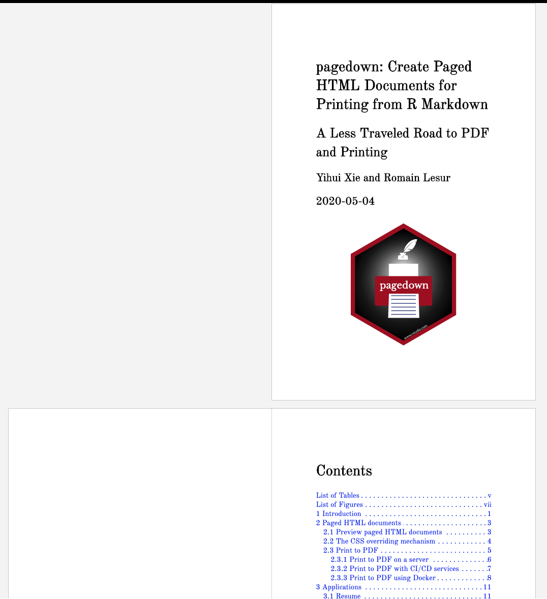
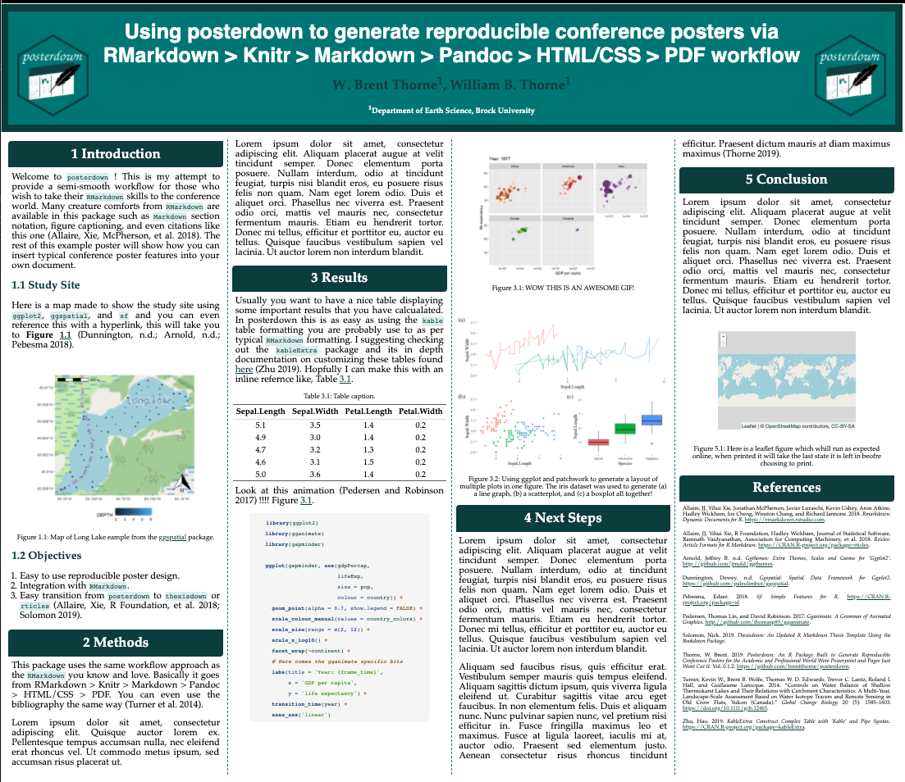
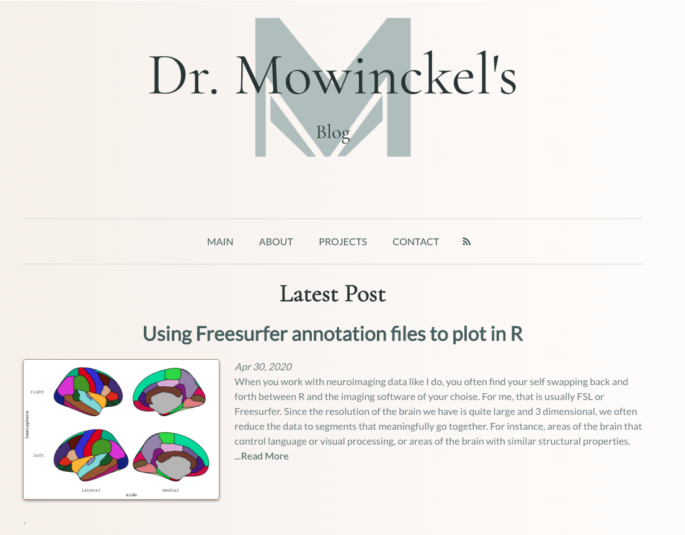
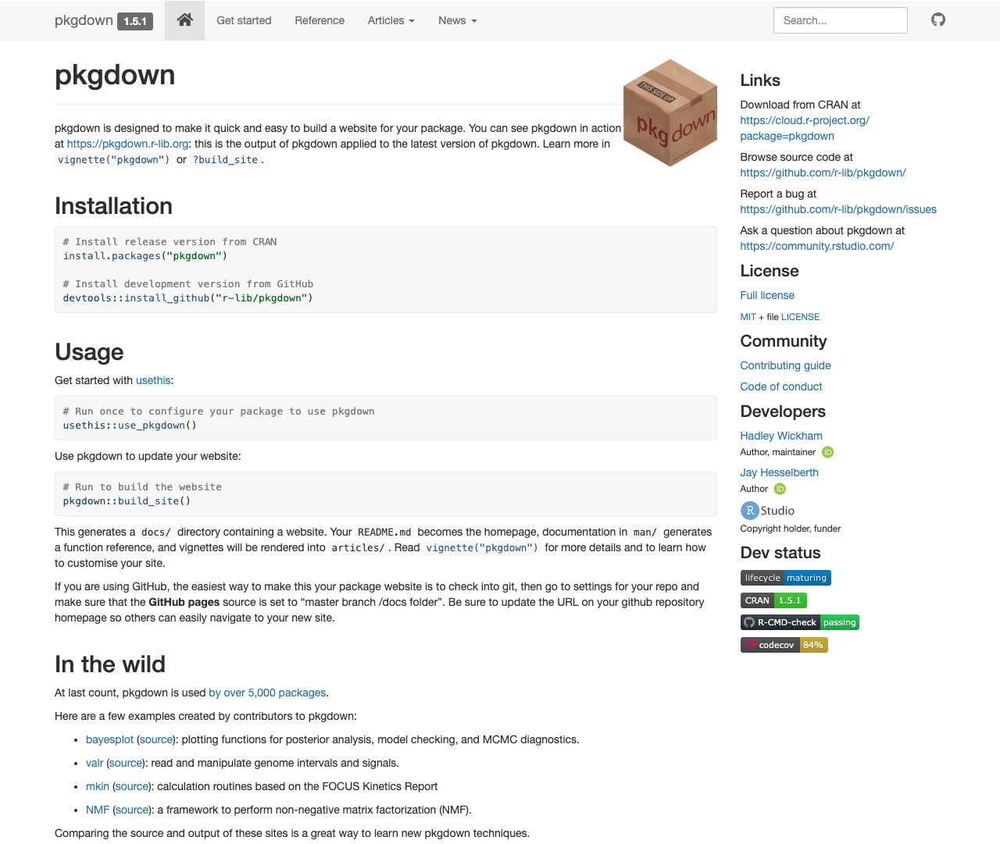
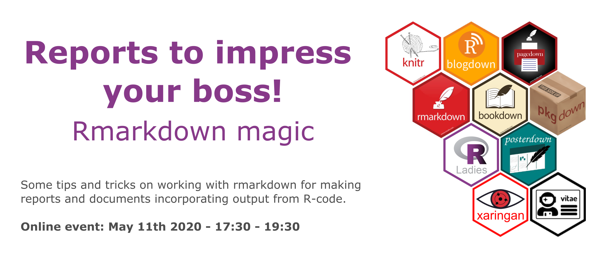

class: center, middle
background-image: url(images/title.png)
background-size: contain

```{r setup, include=FALSE}
options(htmltools.dir.version = FALSE)
knitr::opts_chunk$set(fig.retina = 3)
```

---
class: inverse, right, bottom
background-image: url(https://img.locationscout.net/images/2019-04/oslo-opera-house-norway_l.jpeg)
background-size: cover

# Today

- What is markdown & Rmarkdown?  
     _with a quick intro &nbsp;&nbsp;&nbsp;&nbsp;&nbsp;&nbsp;&nbsp;&nbsp;&nbsp;_       
- Turn your scripts into reports  
- Parametrise your reports  
- Use other code engines!
- My favourite rmarkdown tricks
- Mistakes I made & what I learned  
- Peaks into packages using rmarkdown  


---
class: inverse
background-image: url(https://upload.wikimedia.org/wikipedia/commons/a/ad/Havnelageret%2C_Oslo_%28Norway%29.jpg)
background-size: cover
# What is markdown & Rmarkdown?

.pull-left[
The genious behind markdown is that since it is all in _plain text_, the documents can be read by anyone without special sofware _as is_.
This makes the documents more traceable and also makes then able to be version controlled with, for instence, git. 
]

.pull-right[
Rmarkdown is based on markdown, which uses rich text formatting to create content. 
Rmarkdown is a specialized markdown type, where you can embed bits of code and have either or both of code and output rendered in your document.
This makes Rmarkdown a completely transparent and integrated way of working with text and data simultaneously.
]

---
## but what **is** it?

.pull-left[
### Markdown text  

`**bold text**`  
`_italiced text_`    
`> quote`   
<br><br>
`Ordered list (two spaces after every line)`  
`1. item1`  
`1. item 2`  
&nbsp;&nbsp;&nbsp;&nbsp;&nbsp;&nbsp;`- subitem 1  `  
&nbsp;&nbsp;&nbsp;&nbsp;&nbsp;&nbsp;`- subitem 2  `  

`Unordered list (two spaces after every line)`  
`- unordered list`  
`- item 2` 

]

.pull-right[
### Rendered text  

**bold text**   
_italiced text_  
> quote   

Ordered list (two spaces after every line)  
1. item 1  
1. item 2
    - subitem 1 
    - subitem 2  


Unordered list  
  
- unordered list  
- item 2  

]

---
## but what **is** it?

.pull-left[
`# Header 1`  
<br><br>
`## Header 2`  
<br><br><br>
`### Header 3`  
<br><br>
`#### Header 4` 
]

.pull-right[
# Header 1
## Header 2
### Header 3
#### Header 4

]

---
.pull-left[
```{plain}
# Example text  
This is some text I'd like to **hightlight** 
for you.
It is _quite easy to read_ even when 
not rendered.

## Example 1.2
We can also add images

```
]

.pull-right[
# Example text  
This is some text I'd like to **hightlight** 
for you.
It is quite _easy to read_ even when 
not rendered.

## Example 1.2
We can also add images

]

---
background-image: url(https://www.publicdomainpictures.net/pictures/160000/velka/recycling-concepts-of-sharing.jpg)
background-size: 30%
background-position: 50% 95%
## So it's just text?

Basically, yes.

While any text-editor that understands markdown (many new editors do) will render the formatted text, even without the rendering anyone with a text-editor can _read_ the text in the file. 

This makes is easy to share with people who might not have access to specialized, expensive tools can still access the documents. 

---
## Rmarkdown special

.pull-left[
Uses `code-chunks`. 
Chunks are pieces of code that can be **evaluates** (ie run),
and produce some output. 

It is through code chunks you will add R-code (or even other engines!)
to be executed and that can produce some output to be added to the document.

The below code is executed and the plot to the right is produced

````
```{r "ggplot-ex", eval = FALSE}
library(ggplot2)
ggplot(mtcars, aes(mpg, disp)) + 
  geom_point() +
  labs(title = "Example output")
```
````
]

.pull-right[
```{r "ggplot-ex-exec", ref.label="ggplot-ex", echo = FALSE, out.height='450px'}
```

]

---

background-image: url(images/rmd.png), url(images/knitr.png),url(https://upload.wikimedia.org/wikipedia/commons/thumb/4/48/Markdown-mark.svg/1280px-Markdown-mark.svg.png), url(https://lh3.googleusercontent.com/-S8Fwe-PISrU/WExNwRXJHKI/AAAAAAAAAFo/tRbv1NAYBWoEBitmvDRFY_bc5xv07lnMACLcB/s1600/pandoc.png)
background-size: 10%, 10%, 10%, 13%
background-position: 95% 5%, 95% 30%, 95% 55%,  96% 77%

## Rmarkdown pipeline

Most commonly Rmarkdown is turned into another document type using {knitr} and pandoc


<br><br><br>
This information is not crucial to remember, but good to know.

---
class: bottom, center, inverse
background-image: url(https://farm8.staticflickr.com/7519/15796936669_aa6b4ec422_b.jpg)
background-size: cover

# Turn your scripts into reports

Go to RStudio

---
class: inverse, bottom, center
background-image: url(https://upload.wikimedia.org/wikipedia/commons/thumb/8/8e/Oslo_at_night.jpg/1200px-Oslo_at_night.jpg)
background-size: cover
# Parametrise your reports  


---
## What are parametrised reports?

Do you periodically need to make a report containing more or less the same information, but with different data?

Tedious, time consuming and not the most inspiring work we do!

Watch Sharla Gelfand's [amazing talk at RStudio::conf 2020](https://rstudio.com/resources/rstudioconf-2020/don-t-repeat-yourself-talk-to-yourself-repeated-reporting-in-the-r-universe/) about makding periodic reports and the pains it can bring

---
class: center
background-image: url(https://pbs.twimg.com/media/EXm5IN8UwAADiRQ?format=jpg&name=4096x4096)
background-size: cover

# Use other code engines!

---
## What do you mean other engines?

<br><br>
```{r, echo = FALSE, out.width=c('40%', '20%', '20%', '20%')}
knitr::include_graphics(c(
  "https://www.freepngimg.com/download/python_logo/5-2-python-logo-png-image.png",
  "https://cdn2.iconfinder.com/data/icons/programming-50/64/206_programming-sql-data-database-512.png",
  "https://camo.githubusercontent.com/7c9b27101ba491969d016f2f2427c3e066f7bd0b/68747470733a2f2f63646e2e7261776769742e636f6d2f6f64622f6f6666696369616c2d626173682d6c6f676f2f6d61737465722f6173736574732f4c6f676f732f4964656e746974792f504e472f424153485f6c6f676f2d7472616e73706172656e742d62672d636f6c6f722e706e67",
  "https://avatars3.githubusercontent.com/u/1562726?s=400&v=4")
)
```

---
class: inverse, bottom, center
background-image: url(https://premium.vgc.no/v2/images/2bb781e5-ed39-447a-ac47-2cfd3c63eed0?fit=crop&h=912&w=1440&s=465d93c5b1d9e7481a31f9b798c9e628f0a2c072)
background-size: cover

# My favourite rmarkdown tricks

---
background-image: url(https://www.techadvisor.co.uk/cmsdata/features/3679232/how-to-extract-pages-from-a-pdf-thumb_thumb1200_4-3.jpg)
background-size: 15%
background-position: 95% 5%

## pdf tricks

figure and table captions in pdf files can be a little awkward,  
especially if you want them to have formatting. 

While `fig.cap` _should_ support markdown formatting,  
it does not always succeed.

We can get the figure caption pre-formatted before the chunk and  
then provide this instead.

```{plain}
(ref:figure2-cap) Caption for this very awesome figure. **A** it has sub-plots, **B** so it needs to be _pre-formatted_. 

r 'figure2', fig.cap='(ref:figure2-cap)'}

```


---
background-image: url(https://image.flaticon.com/icons/png/512/29/29515.png)
background-size: 10%
background-position: 95% 5%
## html tricks

In the top `yaml` part you can point to a document containing any css you want to apply to your document.

```yaml
---
output:
  html_document:
    css: "custom.css"
---
```

but you can also make code chunks of css within your rmarkdown document it self!

````
```{css}
h1 {
font-size: 31px;
}
``` 
````
    
---
background-image: url(images/xaringan.png)
background-size: 10%
background-position: 95% 5%
## Xaringan tricks

- adding `???` before `---` gives you presenter notes (toggle them in browser by pressing `p`)
- you can use two-colum layout by using `.pull-left[]` and `.pull-right[]`  
- want code one place, but code output another? 
    - give your code chunk a name, and set `eval = FALSE`
    - create another code chunk and use `ref.label = 'chunk_name_to_execute'` 

---
class: inverse, center
background-image: url(https://s3.eu-north-1.amazonaws.com/oslokommune-magasin/2019/Mai/Y-blokka/_940x528_crop_center-center_82_line/Y-blokka-4B-arkitekter_-illustrasjon-for-RA1.jpg)
background-size: cover

# Mistakes I made & what I learned  

---

## What could possibly go wrong?

--

**When naming code chunks, don't use `_` (underscore), but `-` (dash)**   
Some times when converting to pdf the underscore will cause issues  

--

**When you get latex errors, start stripping down your document untill you find the problem part**  
Some character or character combinations in latex make it break, these are tricky to parse out

--

**Html is easier to render than pdf**  
because you dont need to go through latex, and then get latex errors you dont understand.
If you can "get away" with html reports do that!

--

**Customising html reports is easier than pdf**  
same as above. It is easier to learn a couple of css tricks, than to figure out how to make a latex template!

--

**Lists need _two_ spaces after each element**  
Rmarkdown and markdown will not create a line break (even if text is on different consecutive lines) unless there are _two_ spaces at the end of a line
  - double line break (i.e. consecutive lines have a blank line between them) usually creates a larger line space and is usually not what you are after, so remember the double space at the end

---
class: inverse, center, bottom
background-image: url(https://toffeefee.files.wordpress.com/2012/09/img_3050.jpg)
background-size: cover

## The clean environment

--

**Rmarkdown runs in a completely clean R environment.**  

--

**Nothing in your current working environment will affect compiling your document.**

--

**This is good because it means the document is reproducible.**

--

**This is frustrating _to begin with_ because it is an unfamiliar way of working to many.**

--

**But working like this is the best way of working, learn from it and adopt it as a general coding style.**


---
class: inverse, bottom, center
background-image: url(https://upload.wikimedia.org/wikipedia/commons/c/cc/View_of_trolltunga.jpg)
background-size: cover

# Peaks into packages using rmarkdown  

---
background-image: url(images/bookdown.png)
background-size: 10%
background-position: 42% 2%

## Bookdown
.pull-left[
While writing single reports is quite common, so is also writing book-style reports.  
Book-style reports include chapters, table of contents, appendices etc.    
These are not arbitrary to compile and set up.

Bookdown to the rescue. 
Create lovely books in html, pdf, or even e-book format!

- Yihui Xie's - [Bookdown book on bookdown](https://bookdown.org/yihui/bookdown/)  
]

.pull-right[
```{r, echo = FALSE, out.width='100%'}

```
]

---
background-image: url(images/pagedown.png)
background-size: 10%
background-position: 42% 2%


## Pagedown

.pull-left[
html documents usually are a single page, that can be scrolled for ever and ever an ever.  
Some times, you'd like to have pages also in html, without needing to do pdf or create an  
entire bookdown book.

Pagedown helps you do this, making really sleek paginated html reports.

Pagedown also has templates for html resumes, business cards and more!

- Yihui Xie's - [Paginated html report of paginated html reports](https://pagedown.rbind.io/)  
]

.pull-right[
```{r, echo = FALSE, out.height='100%'}

```
]

---
background-image: url(images/posterdown.png)
background-size: 10%
background-position: 42% 2%


## Posterdown
.pull-left[
Posterdown is great for making... posters!
The package is very simple to use if you know rmarkdown already,
and has some nice tempaltes to build on. 

- Brent Thorne's - [Poster of posterdown](https://brentthorne.github.io/posterdown_html_showcase/)

]

.pull-right[
```{r, echo = FALSE, out.width='100%'}

```
]

---
background-image: url(images/blogdown.png)
background-size: 10%
background-position: 42% 2%


## Blogdown

.pull-left[

Blogging can be a fun way to disseminate research, data and coding.  
It's a great way to show-case your skills and tell others about the cool things you are learning and figuring out.

- Yihui Xie's - [Blogdown book](https://bookdown.org/yihui/blogdown/) 

]

.pull-right[
```{r, echo = FALSE, out.width='100%'}

```
]

---
background-image: url(images/vitae.png)
background-size: 10%
background-position: 42% 2%

## Vitae
.pull-left[

Resume's are important, updating them also important but at times tedious.
And finding nice templates for resumes is not easy.

Vitae is a great package to migrate your resume to Rmarkdown and create truly stunning resumes!

- Mitchell O'Hara-Wild's - [Vitae package for resumes](https://pkg.mitchelloharawild.com/vitae/)  
]

.pull-right[
```{r, echo = FALSE, out.width='100%'}
knitr::include_graphics("https://pbs.twimg.com/media/Dsqo7mdU0AALGEe?format=jpg&name=medium")
```
]

---
background-image: url(images/pkgdown.png)
background-size: 10%
background-position: 42% 2%

## Pkgdown

.pull-left[
If you're making packages, writing documentation in roxygen2 and vignettes in Rmarkdown,
pkgdown is a magical package that with a _single_ function can create a full webpage for your package!

- Hadley Wickham's - [Pkgdown for online package documentation](https://pkgdown.r-lib.org/articles/pkgdown.html)

]

.pull-right[
```{r, echo = FALSE, out.width='100%'}

```
]

---
background-image: url(images/xaringan.png)
background-size: 10%
background-position: 42% 2%


## Xaringan
.pull-left[

Making presentations takes times, making pretty presentations take lots of time.
Especially when you are trying to integrate code and output, perhaps you, like me, often make presentations on how come code works? 

Xaringan is an amazing package to creating presentations in Rmarkdown. It creates html slides, which can then easily be hosted and distributed online!
This presentation is made in Xaringan!!

- Allison Hill's - [Definitive guide to xaringan](https://arm.rbind.io/slides/xaringan.html)
]

.pull-right[
```{r, echo = FALSE, out.width='100%'}

```
]

---
## Flipbookr

.pull-left[
Flipbookr is based on xaringan, and is an ingenious way to set up code teaching using a flip-book type setup. 


- Gina Reynolds' - [Flipbookr for code-teaching!](https://evamaerey.github.io/flipbooks/about)
]

.pull-right[
A brilliant example [here](https://evamaerey.github.io/ggplot2_grammar_guide/ggplot2_grammar_guide.html#27)
]


---
background-image: url(images/hexs.png)
background-size: 50%
background-position: 95% 50%

# Rmarkdown resources

- RStudio's [Rmarkdown cheatsheet](https://github.com/rstudio/cheatsheets/raw/master/rmarkdown-2.0.pdf)
- RStudio's [rticles for scientific journal templates](https://bookdown.org/yihui/rmarkdown/journals.html)
- Garrick Aden-Buie's [xaringanthemer](https://pkg.garrickadenbuie.com/xaringanthemer/)
