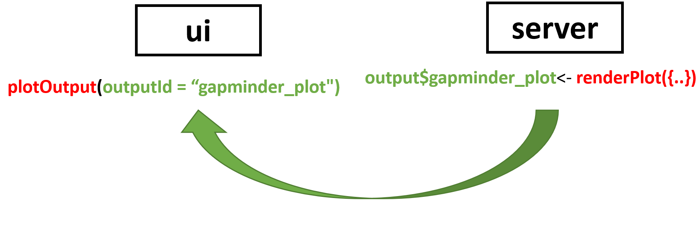
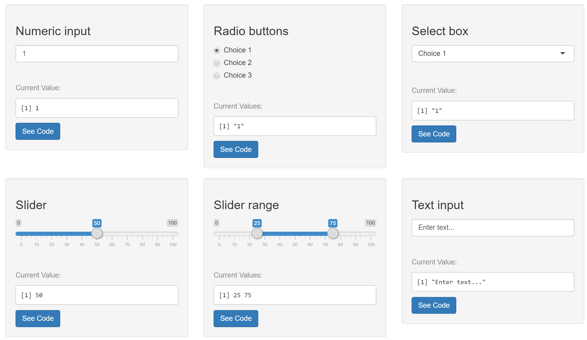

```{r setup, include=FALSE}
options(htmltools.dir.version = FALSE)
knitr::opts_chunk$set(eval = FALSE)
```

# What is shiny?

https://shiny.rstudio.com

---

# Plan for today:

- Step-by-step creation of a shiny dashboard
- A little bit on how shiny works
- Some nice extra features

Code instructions:
```{r}
# This is code you need to add #<<
```


---


#Setup

We need these packages:

```{r, eval = F}
install.packages('shiny')
install.packages('shinydashboard')
install.packages('gapminder')
install.packages('tidyverse')
install.packages('DT')
install.packages('plotly')
```

---


# File structure

We will use the upper file structure:


.center[]


---

# Starter code
- https://rstudio.github.io/shinydashboard/get_started.html or
- https://github.com/rladies/meetup-presentations_oslo -> shiny-workshop/starter_kit

--

```{r, eval = F}
library(shiny)
library(shinydashboard)

# User interface:
ui <- dashboardPage(
  dashboardHeader(),
  dashboardSidebar(),
  dashboardBody()
)

# R code goes here:
server <- function(input, output) {
  
}

# Run the application 
shinyApp(ui = ui, server = server)
```


---


# Title and color

```{r, eval = F}
ui <- dashboardPage(skin = "purple",#<<
  dashboardHeader(title = "Supercool shiny app"),#<<
  dashboardSidebar(),
  dashboardBody()
)
```


---

# Create tabs and menu


```{r}
ui <- dashboardPage(skin = "purple",
  dashboardHeader(title = "Supercool shiny app"),
  dashboardSidebar(
    sidebarMenu(#<<
       menuItem("Table", tabName = "table_tab", icon=icon("chart-bar")),#<<
      menuItem("Plot", tabName = "plot_tab", icon=icon("object-group"))#<<
    )#<<
  ),
  dashboardBody(
    tabItems(#<<
      tabItem(tabName = "table_tab", h2("Data table")),#<<
      tabItem(tabName = "plot_tab", h2("First plot"))#<<
    )#<<
  )
)
```


Icons: https://shiny.rstudio.com/reference/shiny/0.14/icon.html


---

class:inverse, center, middle

# Reactivity = magic?

---

# Connect ui and server

.pull-left[
```{r}
ui <- dashboardPage(
  dashboardHeader(),
  dashboardSidebar(),
  dashboardBody()
)
```
ui: “render” HTML
- Use widgets to create input
- Show output such as text, plots..
]


.pull-right[
```{r}
server <- function(input, output) {
  
  
  
  
}
```
server: run R code
]


---

# Connect ui and server

.pull-left[
```{r}
ui <- dashboardPage(
  dashboardHeader(),
  dashboardSidebar(),
  dashboardBody(
    selectInput(`"input_name"`),
    plotOutput(`"output_name"`)
  )
)
```
]


.pull-right[
```{r}
server <- function(`input`, `output`) {
  
  `output$output_name` <- renderPlot({
    #' use `input$input_name` 
    #' to make plot
  })
}
```

]

---

# Connect ui and server


https://shiny.rstudio.com/articles/reactivity-overview.html

---

# Gapminder data

```{r, eval = T, warning = F, message = F}

library(tidyverse)
library(gapminder)

gapminder %>% 
  head() %>% 
  knitr::kable("html")
```

---

# First output: Data table


---

# First output: Data table


```{r}
library(gapminder) #<<
library(DT) #<<
```


Add the output object under the tab in the ui
```{r}
tabItem(tabName = "table_tab", h2("Data table"),
  dataTableOutput(outputId = "gapminder_table") #<<
)
```

Create the table on the server side
```{r}
server <- function(input, output) { 
  output$gapminder_table <- renderDataTable(datatable(#<<
    data = gapminder, #<<
    filter = ('top')#<<
  ))#<<
}
```


---

# Plots: renderPlot and plotOutput




---

# Plots: renderPlot and plotOutput

```{r}
library(tidyverse) #<<
```

Create a row and a box and a plotOutput in the UI
```{r}
tabItem(tabName = "plot_tab", h2("First plot"),
        fluidRow(#<<
          box(plotOutput("gapminder_plot"))#<<
        )#<<
)
```

Generate the plot on the server side
```{r}
server <- function(input, output) { 
  output$gapminder_plot <- renderPlot({ #<<
    ggplot(data = gapminder, aes(x = year, y = lifeExp, color = country)) +#<<
      geom_line() +#<<
      geom_point() + #<<
      scale_colour_manual(values = country_colors) +#<< 
      theme(legend.position="none")#<<
  })#<<
}
```
---

# Use widgets to interact with the plot


---


# Input widgets:



https://shiny.rstudio.com/gallery/widget-gallery.html


---

# First widget: TextInput

Add another box for the widgets
```{r}
fluidRow(
  box(#<<
    textInput(#<<
      inputId = "plot_title", #<<
      label = "Select title for plot:", #<<
      value = "GDP vs life expectancy")#<<
  ),#<<
  box(plotOutput("gapminder_plot"))
)
```

---


# First widget: TextInput

Connect the widget to the plot on the server side
```{r}
server <- function(input, output) { 
  
  output$gapminder_plot <- renderPlot({ 
    ggplot( data = gapminder, aes(x = year, y = lifeExp, color = country)) + 
      geom_line() + 
      geom_point() +
      scale_colour_manual(values = country_colors) +        
      theme(legend.position="none") +
      ggtitle(input$plot_title) #<<
  }) 
}
```


---

# Filter the data using a sliderInput


Add the widget in the same box
```{r}
sliderInput(inputId = "year_limits", label = "Select years", #<<
            min = min(gapminder$year), max = max(gapminder$year),#<<
            value = c(1977, 2002)#<<
            )#<<

```

Add a filter inside renderPlot on the server side
```{r}
#remember to rename from gapminder to gapminder_data in the plot
gapminder_data <- gapminder %>% #<<
  filter(year >= input$year_limits[1] & year <= input$year_limits[2]) #<<
```

---

# Use selectInput widget to pick continents

Add another widget in the same box
```{r}
selectInput(inputId = "continents", label = "Continents",#<<
            choices = levels(gapminder$continent),#<<
            multiple = TRUE,#<<
            selected = "Europe")#<<

```

And connect it on the server
```{r}
gapminder_data <- gapminder %>% 
  filter(
    year >= input$year_limits[1] & year <= input$year_limits[2],
    continent %in% input$continents #<<
    )
```

---


# Exercise: create a numeric input widget to set the point size

- inputId = "point_size"
- label = "Point size"
- value = 2

ui inside box:
```{r}
#
```


server inside renderPlot:
```{r}
#
```

---

# Exercise: create a numeric input widget to set the point size

The widget goes in the ui
```{r}
numericInput(inputId = "point_size", label = "Point size", value = 2, min = 1) #<<
```


The input$point_size goes into renderPlot
```{r}
ggplot(
  data = gapminder_data, 
  aes(x = year, y = lifeExp, color = country)
) + 
  geom_line() + 
  geom_point(size = input$point_size) + #<<
  scale_colour_manual(values = country_colors) +        
  theme(legend.position="none") +
  ggtitle(input$plot_title)
```

---


# Make it pretty using CSS
Cascading Style Sheets - the "makeup" of your app

Create a new file custom.css under www:
```{css}
.skin-purple .main-header .navbar {background-color: #88398a;}      
.skin-purple .main-header .logo {background-color: #88398a;}
.skin-purple .main-header .logo:hover {background-color: #88398a;}
```


Include it in your app under dashboardBody
```{r, eval = F}
dashboardBody(
  includeCSS("www/custom.css"), #<<
```

Advanced css: download the Rladies stylesheet we made for you from

https://github.com/rladies/meetup-presentations_oslo/tree/master/shiny-workshop/workshop_dashboard/www

```{r, eval = F}
includeCSS("www/rladies_stylesheet.css"), #<<

```


---

#Rladies logo

Download the logo from

https://github.com/rladies/meetup-presentations_oslo/tree/master/shiny-workshop/workshop_dashboard/www

into your app's www folder and add code.

After dashboard title:
```{r}
dashboardHeader(title = "Supercool shiny app",#<<
  tags$li(a(href = 'https://rladies.org/',#<<
            img(src = 'logo.png',#<<
                title = "Rladies Home", height = "30px"),#<<
            style = "padding-top:10px; padding-bottom:10px;"),#<<
          class = "dropdown"))#<<
```


---


# Use plotly for animation

Include plotly
```{r}
library(plotly) #<<
```

Create a new menu item 
```{r}
menuItem("Animated chart", tabName = "animated_tab", icon = icon("spinner")) #<<
```

Create a new tab
```{r}
tabItem(#<<
        tabName = "animated_tab", #<<
        h2("The best stats you've ever seen"),#<<
        box(#<<
          plotlyOutput("animated_plot")#<<
        )#<<
      )#<<
```
---
# Use plotly for animation
Create the plot:
```{r}
output$animated_plot <- renderPlotly({#<<
    
    gapminder_data <- gapminder %>% 
      filter(
        year >= input$year_limits[1] & year <= input$year_limits[2],
        continent %in% input$continents 
      )
    
    p <- ggplot(#<<
      data = gapminder_data, #<<
      aes(x = gdpPercap, y = lifeExp, color = country, frame = year)#<<
    ) + #<<
      geom_point() + #<<
      scale_colour_manual(values = country_colors) + #<<
      theme(legend.position="none")#<<
    
    ggplotly(p)#<<
  })
```


---
class:inverse, center, middle
#Some cool extras

---

# Actionbuttons can do lot's of things for example change tabs

Add button under the widgets in the plot tab
```{r}
actionButton(#<<
  inputId = 'animate_button', #<<
  label = 'Animate this selection'#<<
  )#<<
```

Special: To change tabs we need to name the menu
```{r}
sidebarMenu(id = 'menu',...) #<<
```

---

# Actionbuttons can do lot's of things for example change tabs


Inside server: use **observeEvent** to listen to the button
```{r}
observeEvent(input$animate_button, { #<<
    updateTabItems(session, 'menu', 'animated_tab')#<<
  })#<<
```

Special: add **session** to the server arguments
```{r}
server <- function(input, output, session) { }#<<
```


---

# ColourInput

```{r}
#install.packages('colourpicker')
library(colourpicker) #<<
```


ui inside box:
```{r}
colourInput(inputId="colour", label="Point colour", value = "#88398a") #<<
```

server inside renderPlot:
```{r}
ggplot(
      data = gapminder_data, 
      aes(x = year, y = lifeExp, color = country)
    ) +
      geom_line() +
      geom_point(size = input$point_size, color = input$colour) + #<<
      scale_colour_manual(values = country_colors) +
      theme(legend.position="none") +
      ggtitle(input$plot_title)
```


---


# What next - Shiny in production

- Control reactivity: next topic to learn

- Responsivity: 
  + Done for you
  + App scales size on any gadget (short demo)

- Scaling to many users: 
  + Shinyloadtest - testing synthetic load of many users
  + Profvis - what part of code is slow
  + Keynote talk by Joe Cheng @ rstudioconf:2019:
  https://resources.rstudio.com/rstudio-conf-2019/shiny-in-production-principles-practices-and-tools-joe-cheng

- Deployment: 
  + shiny server: https://www.rstudio.com/products/shiny/shiny-server/ 
  + shinyapps.io: https://shiny.rstudio.com/articles/shinyapps.html 
  + RstudioConnect: https://www.rstudio.com/products/connect/ 
  

  

---

# Next meetup: 18 March!

Bayesian methods for rank and preference data - from recommendation systems to cancer genomics - https://www.meetup.com/rladies-oslo/events/256566088/

See also Oslo useR! on Wednesday: https://www.meetup.com/Oslo-useR-Group/events/256805098/


